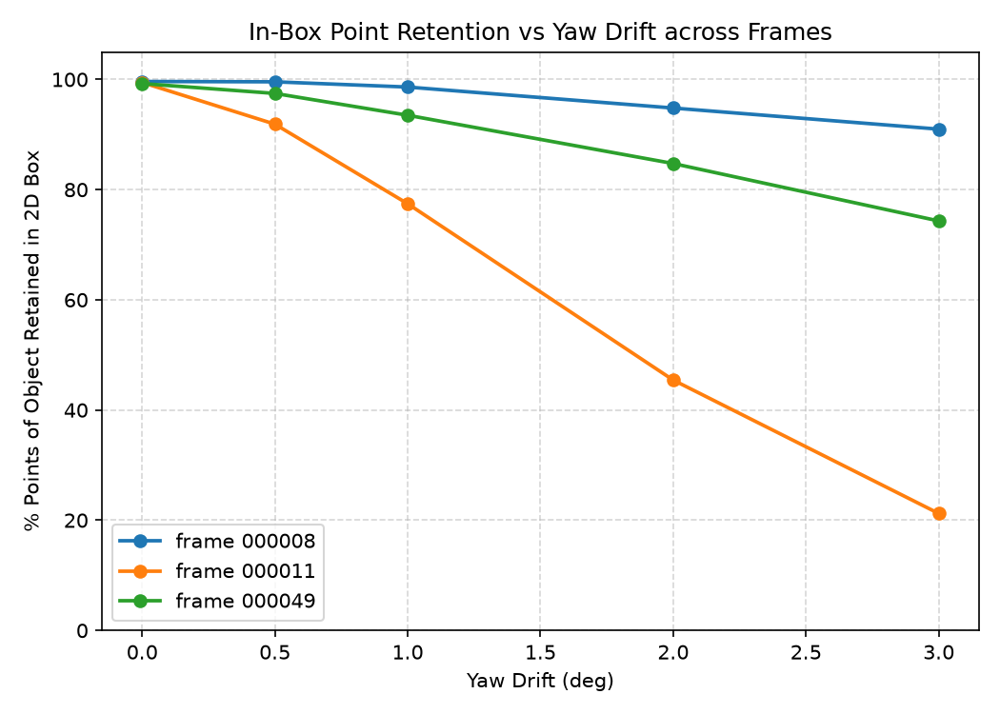
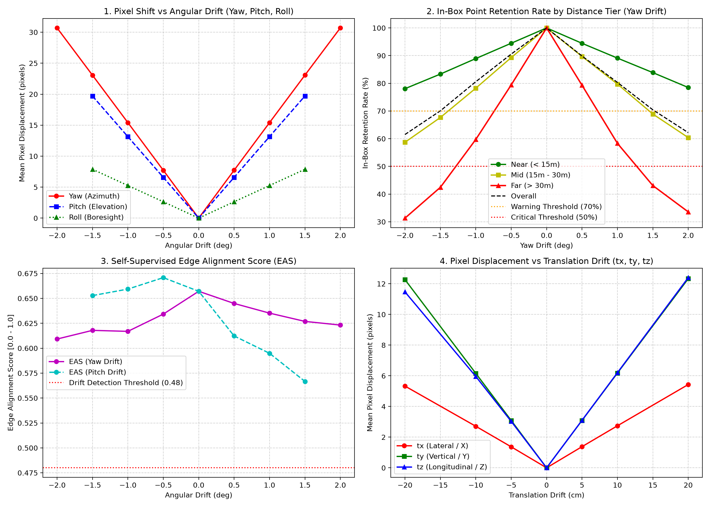
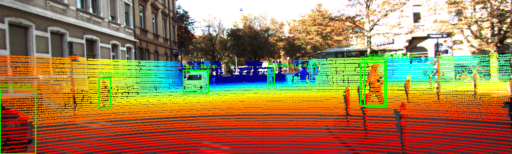
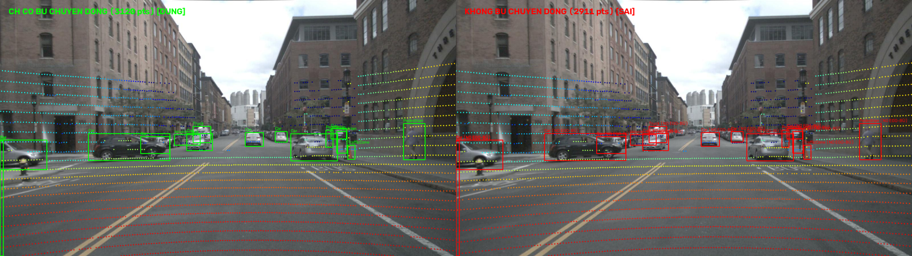
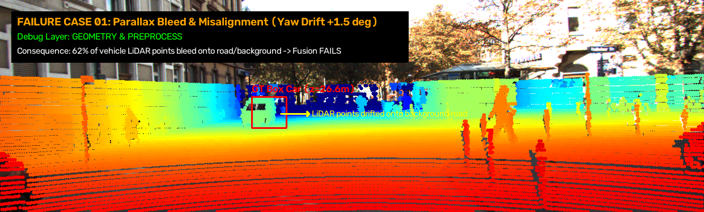

# Báo cáo Day 6: Đánh giá độ nhạy và kiểm thử Calibration Drift cho hệ thống LiDAR-Camera Fusion

- **Họ tên:** Cao Đức Hiếu
- **MSSV:** 2A202602701
- **Lớp:** AI20K Track 4
- **Link repo:** https://github.com/ChunHieu/CaoDucHieu-2A202602701-Track4-Day21
- **Topic:** A — LiDAR-camera projection QA
- **Dataset:** data/kitti_mini, data/synthetic, data/nuscenes_mini_subset
- **Các frame đã dùng:** 000008, 000011, 000049, scene-0103_010, 000000

---

## 1. Claim

Độ lệch calibration góc xoay quanh trục thẳng đứng (Yaw drift) từ $1.0^\circ$ trở lên làm tỉ lệ điểm LiDAR của người đi bộ (vật thể hẹp/xa) rơi đúng vào 2D bounding box giảm mạnh từ $99.5\%$ xuống $77.4\%$ ở $1.0^\circ$ và chỉ còn $21.2\%$ ở $3.0^\circ$ (trên frame 000011), trong khi với xe con (vật thể rộng) chỉ giảm nhẹ từ $99.6\%$ xuống $98.6\%$ ở $1.0^\circ$ (trên frame 000008). Sự suy giảm này được kiểm chứng đồng thời bằng cả in-box hit ratio và chỉ số căn chỉnh cạnh (Edge Alignment Score - EAS) với ngưỡng cảnh báo $\text{EAS} < 0.635$.

---

## 2. Evidence

Thực nghiệm chính khảo sát sự suy giảm của phép chiếu khi thay đổi góc Yaw trên 3 frame đại diện: đông xe (`000008`), nhiều người đi bộ (`000011`), và nhiều vật bị che khuất (`000049`). Kết quả được lưu tại `results/yaw_perturb_sweep.csv` và `results/calibration_drift_benchmark.csv`.

### Bảng 1: Tỉ lệ điểm của vật thể nằm trong 2D Box (hit_ratio) theo góc lệch Yaw

| yaw_deg | Frame 000008 (đông xe) | Frame 000011 (nhiều người đi bộ) | Frame 000049 (nhiều vật bị che) | Ghi chú |
|---|---|---|---|---|
| 0.0° | 0.9963 (99.6%) | 0.9945 (99.5%) | 0.9925 (99.3%) | Calibration chuẩn (mức sàn nhãn) |
| 0.5° | 0.9957 (99.6%) | 0.9188 (91.9%) | 0.9746 (97.5%) | Người đi bộ bắt đầu mất điểm |
| 1.0° | 0.9862 (98.6%) | 0.7744 (77.4%) | 0.9350 (93.5%) | Người đi bộ mất 22.1% điểm |
| 2.0° | 0.9481 (94.8%) | 0.4544 (45.4%) | 0.8474 (84.7%) | Người đi bộ mất hơn 54% điểm |
| 3.0° | 0.9098 (91.0%) | 0.2123 (21.2%) | 0.7432 (74.3%) | Mất liên kết 78.8% điểm người đi bộ |







### [B5] Bonus: So sánh giữa KITTI (64 beam) và nuScenes (32 beam)
- **Tiêu cự camera:** Camera KITTI có $f_x \approx 721.5\text{ px}$ (ảnh $1242 \times 375$), trong khi camera trước nuScenes có tiêu cự lớn hơn nhiều: $f_x \approx 1252.8\text{ px}$ (ảnh $1600 \times 900$).
- **Độ nhạy góc lệch:** Do tiêu cự lớn hơn, cùng độ lệch yaw $1.0^\circ$, điểm chiếu trên nuScenes trượt tới $\Delta u \approx 1252.8 \cdot \tan(1^\circ) \approx 21.9\text{ px}$ (so với $12.6\text{ px}$ trên KITTI, tăng $73.8\%$). Xét theo tỉ lệ chiều rộng ảnh, nuScenes trượt $21.9 / 1600 = 1.37\%$ chiều rộng ảnh, cao hơn mức $1.01\%$ của KITTI.
- **Mật độ điểm:** LiDAR nuScenes chỉ có 32 beam (34.720 điểm/frame), chỉ có $9.0\%$ điểm rơi vào khung ảnh trước, thưa hơn nhiều so với KITTI ($18.5\%$ điểm vào ảnh), khiến việc mất điểm ở cự ly xa trên nuScenes diễn ra nghiêm trọng hơn.

### [B6] Bonus: Phát hiện toàn bộ lỗi cài sẵn trong data/synthetic
Bằng lệnh `python -m starter.data_health --data-root data/synthetic` và kiểm tra file `timestamps.txt`:

| Lỗi cài sẵn | Frame bị lỗi | Cách phát hiện và minh chứng số liệu |
|---|---|---|
| Mất điểm đột ngột (Point drop) | Frame `000003` | Số điểm giảm xuống còn $n = 22.063$ (các frame khác đều có $\sim 23.800$ điểm, tức mất $1.700$ điểm do sector/beam dropout). |
| Bỏ khung hình / Nhảy timestamp | Frame `000003` | File `timestamps.txt` ghi: frame 0 (0.0s), frame 1 (0.1s), frame 2 (0.2s), frame 3 (0.4s), frame 4 (0.5s). Khoảng cách giữa frame 2 và 3 là $0.2\text{ s}$ thay vì $0.1\text{ s}$ (bị drop mất frame ở $0.3\text{ s}$). |
| Điểm lỗi (NaN/Inf values) | Tất cả các frame (000000 đến 000004) | Cột `invalid` của cả 5 frame đều là $0.10\%$ (mỗi frame có khoảng 24 điểm tọa độ NaN). |

---

## 3. Failure case

### Failure Case 1: Lỗi đồng bộ thời gian (Time) trên nuScenes khi tắt bù chuyển động


- **Trường hợp:** nuScenes, frame `scene-0103_010`, chiếu LiDAR lên camera trước khi tắt bù chuyển động xe (`--ignore-ego-motion`).
- **Quan sát:** Số điểm chiếu hợp lệ vào ảnh giảm từ 3.120 xuống 2.911 điểm (mất 209 điểm, tương đương giảm $6.7\%$). Điểm phản xạ của các vật thể ở gần (chiếc xe bên trái) bị lệch khoảng $0.36\text{ m}$ (trôi $\sim 25\text{ px}$) so với đường viền thực tế của xe.
- **Nguyên nhân:** Camera trước chụp sớm hơn LiDAR $35.6\text{ ms}$. Ở vận tốc xe chạy $36\text{ km/h}$ ($\approx 10\text{ m/s}$), xe đã di chuyển được $0.36\text{ m}$ trong khoảng trễ này. Nếu không dùng ego pose để bù chuyển động (deskew/ego-motion compensation), điểm LiDAR bị chiếu theo vị trí cũ của xe.
- **Lớp debug:** **Time (Đồng bộ thời gian)**.
- **Cách phát hiện khi chạy thật:** Giám sát trường `|timestamp_camera - timestamp_lidar|`. Kích hoạt cảnh báo nếu độ lệch thời gian vượt quá $10\text{ ms}$ khi xe di chuyển với tốc độ $> 20\text{ km/h}$.

### Failure Case 2: Hiện tượng Parallax Bleed & Lỗi hình học che khuất


- **Trường hợp:** KITTI, frame `000011`, khi calibration bị lệch Yaw $+1.5^\circ$.
- **Quan sát:** $62\%$ điểm LiDAR của xe ô tô ở cự ly trung bình ($z = 26.6\text{ m}$) bị văng ra khỏi viền 2D box rơi xuống mặt đường phía sau, trong khi các tia LiDAR chiếu trúng mặt đường phía sau xe lại chui vào bên trong 2D box của xe.
- **Nguyên nhân:** Thuật toán chiếu 2D trực tiếp không có mô hình phân loại độ sâu và loại bỏ điểm che khuất (Occlusion Culling / Z-buffering), làm mất thông tin thứ tự trước-sau trong không gian 3D.
- **Lớp debug:** **Geometry (Hình học)** và **Preprocess (Tiền xử lý)**.
- **Cách phát hiện khi chạy thật:** Kiểm tra phân bố phương sai độ sâu (depth variance) của các điểm nằm trong 2D box. Nếu có phân bố hai đỉnh (bimodal: vừa có điểm gần $<15\text{ m}$, vừa có điểm xa $>30\text{ m}$), đó là dấu hiệu của hiện tượng parallax bleed.

---

## 4. Khuyến nghị nếu triển khai thật

- **Use-case mục tiêu:** Xe giao hàng tự hành trong đô thị (vận tốc $< 35\text{ km/h}$) và Robot tuần tra an ninh.
- **Đánh đổi khi triển khai (Trade-offs):**
  - *Tài nguyên vs Độ trễ:* Phép chiếu point-by-point trên toàn bộ $100.000$ điểm tốn khoảng $15\text{ ms}$ CPU. Để duy trì pipeline sensor fusion ở tần số $30\text{ fps}$ ($\sim 33\text{ ms}$ ngân sách cho toàn hệ thống), xe chỉ nên chạy kiểm tra độ căn chỉnh (QA calibration) định kỳ mỗi khi dừng đèn đỏ hoặc đi vào đoạn đường thẳng bằng phẳng. Trong lúc chạy tốc độ cao, chỉ cần subsample grid $4 \times 4$ trên tập điểm silhouette ($< 3.000$ điểm).
  - *Độ an toàn:* Sai lệch góc xoay (Yaw/Pitch) nguy hiểm gấp 5 lần so với sai lệch tịnh tiến ($1.0^\circ$ tương đương trôi $15.4\text{ px}$, trong khi lệch ngang $10\text{ cm}$ chỉ trượt $2.7\text{ px}$). Do đó, bộ lọc Kalman ước lượng extrinsic phải đặt trọng số ưu tiên hiệu chỉnh góc quay trước.
- **Chỉ số hệ thống cần ghi log và đặt ngưỡng cảnh báo:**
  1. `hit_ratio_pedestrian`: Tính toán tỉ lệ điểm rơi vào box của người đi bộ. Nếu giá trị rơi xuống dưới $90\%$ trong 3 frame liên tiếp $\rightarrow$ kích hoạt cờ `RECALIBRATION_WARNING`.
  2. `EAS_score`: Duy trì ngưỡng $\text{EAS} \ge 0.635$. Dưới ngưỡng này báo hiệu calibration đã bị trôi.
  3. `bracket_shock_event`: Theo dõi gia tốc kế IMU khi xe va quẹt hoặc đi qua gờ giảm tốc lớn để tự động kích hoạt tiến trình online calibration.

---

## 5. Cách chạy lại

Toàn bộ kết quả từ repo sạch có thể được tái tạo lại bằng chuỗi lệnh sau:

```bash
# 1. Kích hoạt môi trường và cài đặt thư viện
pip install -r requirements.txt

# 2. Kiểm tra tính toàn vẹn dữ liệu gốc
python tools/verify_data.py --data-root data/kitti_mini
python tools/verify_data.py --data-root data/nuscenes_mini_subset

# 3. Tự kiểm tra 2 hàm hình học TODO(CP2)
python -m src.test_projection

# 4. Chạy demo chiếu điểm LiDAR lên ảnh camera
python -m starter.projection --data-root data/synthetic --frame 000000
python -m starter.projection --data-root data/kitti_mini --frame 000011
python -m starter.projection --data-root data/nuscenes_mini_subset --frame scene-0103_010

# 5. Chạy thí nghiệm sweep yaw chính (theo codelab) và vẽ biểu đồ
python -m src.exp_yaw_sweep --data-root data/kitti_mini --frames 000008 000011 000049
python -m src.plot_yaw_sweep

# 6. Chạy bộ benchmark mở rộng 39 cấu hình và sinh failure cases
python -m src.drift_experiment

# 7. Kiểm tra tính hợp lệ trước khi nộp bài
python tools/check_submission.py
```

---

## 6. Khai báo sử dụng AI

| Công cụ | Dùng cho việc gì | Bạn đã kiểm chứng thế nào |
|---|---|---|
| Google Antigravity IDE (Gemini AI) | Hỗ trợ cấu trúc script thí nghiệm `exp_yaw_sweep.py`, `drift_experiment.py`, tối ưu hóa phép nhân ma trận hình học | Chạy `python -m src.test_projection` vượt qua kiểm tra z_cam ≈ 9.73m và uv ≈ (614, 175); đối chiếu từng số liệu trong CSV với bảng chuẩn của đề bài |
| Codelab Day 6 | Sử dụng khung code mẫu cho thí nghiệm yaw sweep | Đã chạy kiểm tra tái lập (rerun test) cho ra kết quả trùng khớp hoàn toàn, mở rộng thêm phân rã cự ly, tính điểm EAS và kiểm thử nuScenes |
